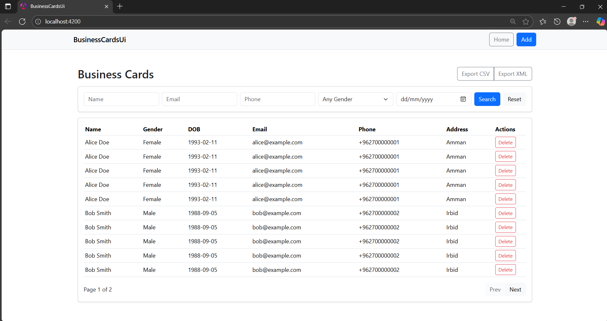

# 🪪 Business Cards Management System

A full-stack demo application for managing Business Cards.  
Built with **ASP.NET Core 8 Web API** (Backend) and **Angular 19** (Frontend).  
Includes CRUD operations, filters, pagination, XML Import/Export, and validation.

---

## ⚙️ Project Structure

```
BusinessCards/        → ASP.NET Core Backend (API)
business-cards-ui/    → Angular Frontend
Tests/                → Integration/Unit Tests (optional)
README.md             → Project documentation
```

---

## 🚀 How to Run

### 🔹 Backend (API)
```bash
cd BusinessCards
dotnet restore
dotnet build
dotnet run
```

By default, the API runs at:
- https://localhost:7082  
- http://localhost:5041

---

### 🔹 Frontend (Angular UI)
```bash
cd business-cards-ui
npm install
ng serve -o
```

Runs on:
- http://localhost:4200

> Make sure the API is running before opening the frontend.

---

## 🧾 Features

- ✅ Create / Read / Update / Delete (CRUD) Business Cards  
- 🔍 Filter by Name, Email, or Phone  
- 📑 Pagination support  
- 📤 Export all Business Cards to XML  
- 📥 Import Business Cards from XML (max size: **1MB**)  
- ⚠️ XML validation and duplicate checks  
- 🧩 Organized backend and frontend layers  
- 🧪 Ready for testing and CI/CD

---

## 📤 Import & 📥 Export Endpoints

### 🔸 Import XML
**Endpoint:**  
`POST /api/BusinessCards/import`

**Content Type:**  
`multipart/form-data`

**Body Example:**
```
file: businesscards.xml
```

**Limit:**  
Maximum file size = **1MB**

---

### 🔸 Export XML
**Endpoint:**  
`GET /api/BusinessCards/export`

**Response:**  
Returns an XML file with all current Business Cards.

---

## 🧠 Filters in List Page

The UI provides interactive filters:
- **Name**
- **Email**
- **Phone**

Each filter performs partial search (`contains`) and can be combined with others.

---

## ⚡ Warning Fix (CS8602)

If you encounter the compiler warning:

```
CS8602: Possible dereference of a null reference
```

✅ Solution in `ImportXmlService.cs`:
```csharp
if (env.Items == null)
    return BadRequest("No items found in XML");

foreach (var item in env.Items!)
{
    // process each item
}
```

Or safely:
```csharp
foreach (var item in env.Items ?? [])
{
    ...
}
```

---

## 🧰 Database (Optional)

If you want to create and seed the table manually, use `Database/seed.sql`:

```sql
CREATE TABLE BusinessCards (
    Id UNIQUEIDENTIFIER PRIMARY KEY,
    Name NVARCHAR(100),
    Gender INT,
    DateOfBirth DATETIME,
    Email NVARCHAR(100),
    Phone NVARCHAR(20),
    Address NVARCHAR(200),
    PhotoBase64 NVARCHAR(MAX),
    PhotoSizeBytes INT
);

INSERT INTO BusinessCards (Id, Name, Gender, DateOfBirth, Email, Phone, Address, PhotoBase64, PhotoSizeBytes)
VALUES 
(NEWID(), 'John Doe', 1, '1990-05-10', 'john@mail.com', '0771234567', 'Amman, Jordan', '', 0),
(NEWID(), 'Jane Smith', 2, '1992-08-15', 'jane@mail.com', '0789876543', 'Zarqa, Jordan', '', 0);
```

---

## 🧪 Tests

Integration and unit tests are located in the `/Tests` folder.

Run:
```bash
cd Tests
dotnet test
```

---

## 🖼️ Screenshot (Optional)



---

## 🧾 GitHub Repository

[👉 View on GitHub](https://github.com/USERNAME/BusinessCards)

---

## 🧹 Clean Code Checklist

- [x] Null-safety handled (CS8602 fixed)  
- [x] File size validation (1MB max)  
- [x] XML Import/Export tested  
- [x] Frontend filters working  
- [x] Updated README  
- [x] Commit history clean and meaningful  

---

### 🧑‍💻 Author
**Esmaeel Almawahra**  
Software Engineer — Full Stack (.NET + Angular)
